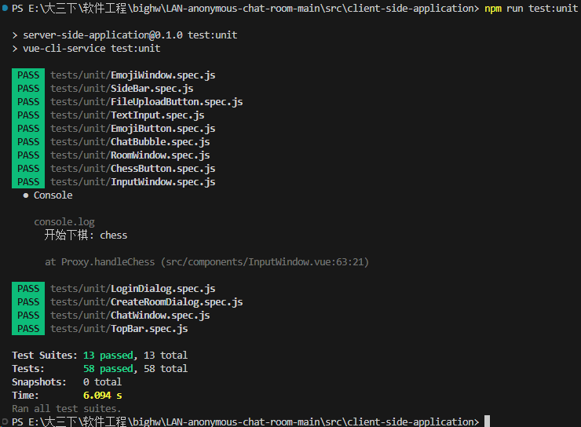

# 软件测试与质量保证报告

## 一、测试目标

1. 功能完整性：验证所有预期功能是否正确实现，包括用户注册、登录、消息发送接收、聊天室创建等。
2. 分布式性能：测试系统在不同节点数量下的性能表现，包括消息传播速度和一致性。
3. 匿名性保证：确保用户身份信息在通信过程中得到有效保护。
4. 安全性：验证端到端加密的有效性，确保消息不被未授权方截获或解读。
5. 用户体验：确保界面友好，操作流畅，响应及时。
6. 故障恢复：测试系统在节点崩溃或网络中断后的恢复能力。
7. 可靠性：测试系统在各种网络条件下（如节点离线、网络波动）的稳定性。
8. 可扩展性：评估系统随着节点增加的扩展能力。
9. 网络效率：测试系统对局域网带宽的利用效率。
10. 一致性：验证所有节点上的数据一致性。

## 二、测试范围

1. 用户界面功能：登录、注册、消息发送、接收、房间创建等所有UI交互。
2. 响应性：界面在不同操作负载下的响应速度。
3. 兼容性：在不同浏览器和设备上的表现。
4. 本地数据管理：消息历史、用户设置等本地存储的管理。
5. 并发测试： 多用户同时操作大量消息并发处理
6. 分布式系统测试用例： 节点发现和连接

## 三、测试环境

- 硬件环境
  - 服务器：推荐配置双核处理器，8GB内存
  - 客户端设备：Windows, macOS, 主流Linux发行版
- 软件环境
  - 操作系统：Windows 10/11, macOS, Ubuntu
  - 浏览器：Chrome, Firefox, Edge, Safari
- **网络环境**：局域网

## 四、测试策略

1. **单元测试**：对每个独立的功能模块进行独立测试。
2. **集成测试**：逐步集成各个模块，测试它们之间的交互。
3. **系统测试**：在实际的局域网环境中部署多个节点进行全面测试。
4. 性能测试
   1. 进行负载测试，评估系统在高并发情况下的表现。
   2. 进行长时间的稳定性测试，确保系统可以持续稳定运行。
5. 安全测试
   - 进行渗透测试，尝试破解加密和匿名机制。
   - 进行数据泄露测试，确保用户隐私得到保护。
6. 故障注入测试
   - 模拟节点崩溃、网络分区等故障场景。
   - 测试系统的自动恢复和数据一致性维护能力。
7. 用户接受度测试
   - 邀请真实用户在模拟环境中使用系统。
   - 收集用户反馈，评估用户体验。

## 五、测试用例

### 1.前端

##### 测试工具：JEST

##### 功能测试用例

######  inputWindow

1. FileUpLoadButton

   - **渲染按钮**：测试按钮是否存在。
   - **点击按钮调用 `clickUpload` 方法**：测试按钮点击是否触发 `clickUpload` 方法。
   - **`clickUpload` 方法触发 input 点击**：测试 `clickUpload` 方法是否触发文件输入的点击事件。
   - **文件选择触发 `upload-file` 事件**：测试文件选择是否触发 `upload-file` 事件，并且事件携带选中的文件。

2. ChessButton

   - **设置 Vue 测试环境**：创建一个新的 `localVue` 实例，并使用 `ElementPlus` 插件。

   - **测试按钮渲染**：确保按钮正确渲染。
   - **测试 `playChess` 方法**：点击按钮时调用 `playChess` 方法。
   - **测试显示 `chessAcceptWindow`**：调用 `playChess` 方法后，确保 `chessAcceptWindow` 显示。
   - **测试 `submitFormCreate` 方法**：验证表单创建逻辑。
   - **测试 `submitFormLogin` 方法**：验证表单加入逻辑。
   - **测试事件触发**：调用 `playChess` 方法时，确保触发 `start-chess` 事件。
   - **测试关闭窗口**：调用 `closeWindow` 方法时，确保窗口隐藏。

3. EmojiButton

   - **测试按钮渲染**：确保按钮正确渲染。
   - 检查按钮点击后是否显示和隐藏 `EmojiWindow` 组件。
   - 检查选择表情符号后是否触发了 `send-emoji` 事件并关闭 `EmojiWindow` 组件。

4. EmojiWindow

   - 检查组件是否渲染了所有的表情符号。
   - 检查点击表情符号后是否触发了 `select-emoji` 事件，并且事件携带了正确的表情符号。

5. TextInput

   - **渲染组件**：渲染一个 `textarea` 和一个 `button`。
   - **文本输入**：当 `textarea` 的值改变时，更新组件的 `text` 数据。
   - **发送文本**：
     - 当按下 "Enter" 键时发送文本，并且清空 `textarea`。
     - 发送后触发 `send-text` 事件，传递输入的文本内容。
     - 禁止发送空文本。
   - **插入换行**：
     - 当按下 "Ctrl+Enter" 键时，在当前文本后插入换行符。
   - **发送按钮点击事件**：
     - 当点击发送按钮时，发送文本并清空 `textarea`。
     - 发送后触发 `send-text` 事件，传递输入的文本内容。
   - **处理 `emojiMessage` 属性变化**：
     - 当 `emojiMessage` 属性的值改变时，将该值附加到当前文本后。
     - 属性变化后，触发 `clearEmojiMessage` 事件。
   - **防止快速发送文本**：
     - 防止在短时间内多次发送文本。

###### chatWindowComponent

1. ChatBubble
   - 分别编写两个测试用例，用于测试 `same` 为 true 和 false 时组件的渲染结果。
   - 使用 `shallowMount` 方法浅挂载 `ChatBubble` 组件，传入不同的 props 组合。
   - 确保组件能够正确渲染，包括正确的 HTML 结构和样式。

   - 使用 Jest 的断言函数对组件的渲染结果进行断言，确保组件的各个部分（如头像、用户名等）能够正确显示。
   - 断言组件的各个元素是否存在，并且其内容或属性是否符合预期。

###### SideBarComponent

1. RoomWindow

   - **测试属性渲染**：

     - 测试组件是否正确渲染传入的 `roomname`, `newestMessage` 和 `roomAvatar`。
     - 断言截断后的消息内容是否正确显示。

   - **测试动态样式**：

     - 修改 `room-info` 中的 `currentRoomName`，并断言组件的动态样式是否正确应用。
     - 分别测试当 `currentRoomName` 与组件的 `roomname` 相同和不同时的背景色。

   - **测试点击事件处理**：

     - 模拟点击事件，并测试 `currentRoomName` 是否被正确设置为组件的 `roomname`。

     **测试双击头像事件**：

     - 模拟头像的双击事件，并断言组件是否正确发出了 `random-update-room-avatar` 事件，以及事件的参数是否为 `roomname`。

###### TopBarComponents

1. CreateRoomDialog

   - **测试组件渲染**：

     - 测试当 `visible` 属性为 `true` 时，组件是否正确渲染。
     - 测试当 `visible` 属性为 `false` 时，组件是否不渲染。

   - **测试取消按钮事件**：

     - 模拟点击取消按钮，并检查组件是否正确发射了 `close` 事件。

     **测试表单提交**：

     - 模拟输入房间名并点击提交按钮，检查组件是否正确发射了 `createroom` 事件，以及事件参数是否为输入的房间名。

     **测试表单验证**：

     - 模拟点击提交按钮而不输入房间名，检查组件是否显示验证错误消息。

2. LoginDialog

   - **渲染测试**:

     - 检查组件在 `visible` 为 `true` 和 `false` 时是否正确渲染。

     **关闭事件测试**:

     - 测试点击取消按钮时是否触发 `close` 事件。

     **登录和注册事件测试**:

     - 测试表单验证通过后是否正确触发 `login` 和 `register` 事件。
     - 模拟在输入框中输入值并点击提交按钮。

     **验证错误测试**:

     - 测试表单验证失败时是否显示错误消息。

###### Component

1. **ChatWindow.vue**

   - 模拟依赖注入
     - 使用 `jest.mock` 和 `jest.spyOn` 来模拟 `inject` 函数，确保在测试环境中提供所需的依赖项（如 `chat_window_text`、`message-info` 和 `login-info`）。
     - 创建一个 `mockInject` 函数，根据不同的键返回相应的模拟值，包括 `ref` 对象。
   - **渲染测试**：
     - 使用 `mount` 函数挂载 `ChatWindow` 组件。
     - 验证组件是否正确渲染了消息列表，检查 `ChatBubble` 组件的数量和每个 `ChatBubble` 组件的 props（如 `text`、`avatar`、`username` 和 `same`）。
   - **滚动事件处理测试**：
     - 找到组件中的 `.scroll-box` 元素。
     - 模拟 `mousewheel` 事件，并检查 `scrollLeft` 属性是否正确更新。
     - 确保滚动事件处理函数 `handleScroll` 能够正确处理滚动方向和距离。
   - **挂载时滚动位置测试**：
     - 验证组件在挂载时是否将 `scrollTop` 设置为 `scrollHeight`，确保新消息出现时滚动条在最底部。
   - **用户身份检查测试**：
     - 验证 `isUser` 函数是否正确判断消息是否由当前登录用户发送。
     - 可以通过检查 `ChatBubble` 组件的 `same` prop 来验证这一点。
   - **全局组件注册测试**：
     - 确保在挂载组件时正确注册了 `ChatBubble` 组件。

2. **InputWindow.vue**

   - **组件渲染测试**：
     - 使用 `mount` 函数挂载 `InputWindow` 组件。
     - 检查组件是否包含 `EmojiButton`、`FileUploadButton`、`ChessButton` 和 `TextInput` 子组件。
     - 检查组件的结构和样式是否符合预期。
   - **事件处理测试**：
     - 模拟 `TextInput` 的 `send-text` 事件，触发 `handleSendText` 方法，检查文本长度为0时的警告和文本长度大于0时的 `sendtext` 事件触发。
     - 模拟 `FileUploadButton` 的 `upload-file` 事件，触发 `handleUploadFile` 方法，检查 `send-file` 事件触发。
     - 模拟 `EmojiButton` 的 `send-emoji` 事件，触发 `handleSendEmoji` 方法，检查 `emojiMessage` 数据属性更新。
     - 模拟 `ChessButton` 的 `start-chess` 事件，触发 `handleChess` 方法，检查控制台输出。
     - 调用 `clearEmojiMessage` 方法，检查 `emojiMessage` 数据属性是否被清除。
   - **子组件交互测试**：
     - 使用 `wrapper.findComponent` 找到子组件，模拟子组件的事件触发，检查 `InputWindow` 组件的响应。
   - **数据属性测试**：
     - 检查 `text` 和 `emojiMessage` 数据属性的初始值。
     - 在事件处理过程中，检查这些数据属性的更新情况。
   - **样式测试**：
     - 检查组件的样式是否符合预期，特别是 `input-window`、`topWindow` 和 `bottomWindow` 的布局和样式。

3. **SideBar.vue**

   - **模拟 `RoomWindow` 组件**：
     - 使用 `jest.mock` 来模拟 `RoomWindow` 组件，因为我们主要测试 `SideBar` 组件的行为，而不是 `RoomWindow` 组件。
   - **测试渲染 `RoomWindow` 组件**：
     - 提供一个 `roomInfo` 对象，包含 `roomList` 数据。
     - 挂载 `SideBar` 组件，并检查是否正确渲染了 `RoomWindow` 组件，并且传递了正确的 props。
   - **测试事件发射**：
     - 挂载 `SideBar` 组件，并触发 `random-update-room-avatar` 事件。
     - 检查 `SideBar` 组件是否正确发射了 `random-update-room-avatar` 事件

4. **TopBar.vue**

   - **渲染测试**:

     - 检查组件的初始渲染，确保包含 `LoginDialog` 和 `CreateRoomDialog` 组件，以及用户头像和按钮。

     **按钮点击事件测试**:

     - 检查登录按钮点击后是否正确显示登录对话框，登录状态改变后再次点击是否触发登出事件。
     - 检查创建房间按钮点击后是否正确显示创建房间对话框。

     **对话框事件测试**:

     - 模拟登录对话框的登录和注册事件，检查是否正确触发相应事件，并关闭对话框。
     - 模拟创建房间对话框的创建房间事件，检查是否正确触发相应事件，并关闭对话框。

     **双击头像事件测试**:

     - 检查双击头像是否触发 `random-change-user-avatar` 事件。

5. 用户注册
   - **输入有效信息注册成功**

     - **测试场景**：用户输入有效的用户名、密码和其他必要信息。
     - **预期结果**：注册成功，用户收到成功注册的消息，并被重定向到登录页面或主页面。

     **输入无效信息注册失败**

     - **测试场景**：用户输入无效的用户名或密码（例如，密码太短或用户名已存在）。
     - **预期结果**：注册失败，用户收到错误消息，提示需要修改输入信息。

6. 用户登录
   - **输入正确的用户名和密码登录成功**

     - **测试场景**：用户输入正确的用户名和密码。
     - **预期结果**：登录成功，用户被重定向到主页面，可以正常使用系统功能。

     **输入错误的用户名或密码登录失败**

     - **测试场景**：用户输入错误的用户名或密码。
     - **预期结果**：登录失败，用户收到错误消息，提示用户名或密码错误。

7. 消息发送
   - **在不同房间中发送消息**
     - **测试场景**：用户在多个聊天室中发送多种不同类型消息，包括文字、表情包、图片、文件。
     - **预期结果**：消息成功发送，其他用户可以在对应的聊天室中看到消息。

8. 聊天室创建
   - **创建新聊天室**
     - **测试场景**：用户输入房间名并创建新的聊天室。
     - **预期结果**：聊天室成功创建，用户自动加入新创建的聊天室，其他用户可以看到并加入该聊天室。

9. 游戏

   - 创建游戏房间
   - 加入游戏房间
   - 在线游戏

#### 性能测试用例

1. 高并发消息发送
   - **测试场景**：模拟同时有50个用户发送消息。
   
     **预期结果**：系统能够处理所有消息，消息在所有用户界面及时显示，没有显著的延迟或丢失。
2. 长时间运行
   - **测试场景**：系统连续运行72小时。
   
     **预期结果**：系统在72小时内保持稳定，无崩溃、内存泄漏或性能显著下降。

#### 安全测试用例

1. 端到端加密
   - **测试场景**：在消息传输过程中检查数据包。
   
     **预期结果**：确认消息内容在传输过程中经过加密，未授权方无法读取消息内容。
   
2. 权限管理
   - **测试场景**：尝试未授权用户访问聊天室。
   
     **预期结果**：未授权用户无法访问聊天室，系统正确提示权限不足或拒绝访问。
     
     

### 2.后端

#### (1) 单元测试

**用户模块**

1. **用户注册**
   - 测试有效的注册信息：
     - 发送包含用户名、邮箱和密码的注册请求，验证用户是否成功注册。
     - 确保数据库中新增了用户的记录，并且密码以安全的方式存储（如哈希加密）。
   - 测试无效的注册信息：
     - 发送缺少必填字段（如用户名、密码或邮箱）的注册请求，验证系统是否返回适当的错误信息。
     - 发送已存在的用户名或邮箱的注册请求，验证系统是否返回适当的错误信息。
2. **用户登录**
   - 测试有效的登录信息：
     - 使用注册过的用户凭据登录，验证系统是否返回有效的身份验证令牌。
     - 确保登录成功后返回的令牌能够用于后续的受保护资源访问。
   - 测试无效的登录信息：
     - 使用无效的用户名或密码进行登录，验证系统是否拒绝访问并返回适当的错误信息。
3. **用户更新**
   - 测试有效的用户信息更新：
     - 发送包含更新字段（如用户名、邮箱、密码）的请求，验证用户信息是否成功更新。
     - 确保更新后可以使用新的凭据登录，并验证数据库中用户信息已更新。
   - 测试无效的用户信息更新：
     - 尝试更新为无效的信息（如过短的密码或无效的邮箱格式），验证系统是否返回适当的错误信息。
4. **用户更换头像**
   - 测试用户更换头像功能：
     - 发送有效的图片文件作为头像上传请求，验证头像是否成功更换并存储在适当的位置。
     - 发送无效的图片文件（如超过大小限制或不支持的格式），验证系统是否返回适当的错误信息。

**聊天室模块**

1. **聊天室创建**
   - 测试创建新聊天室：
     - 发送包含聊天室名称和描述的创建请求，验证聊天室是否成功创建并存储在数据库中。
     - 确保创建者自动加入新创建的聊天室。
2. **聊天室更新**
   - 测试更新聊天室信息：
     - 发送包含更新字段（如名称或描述）的请求，验证聊天室信息是否成功更新。
     - 确保更新后能够获取到更新后的聊天室信息。
3. **获取聊天室信息**
   - 测试获取聊天室详情：
     - 发送获取特定聊天室详情的请求，验证系统是否返回正确的聊天室信息。
     - 确保返回的信息包含聊天室成员列表和其他相关信息。
4. **加入聊天室**
   - 测试用户加入聊天室功能：
     - 发送加入特定聊天室的请求，验证用户是否成功加入聊天室成员列表。
     - 确保用户成功加入后能够接收到聊天室的消息通知。
5. **发布消息**
   - 测试在聊天室中发布消息：
     - 发送包含消息内容的请求，验证消息是否成功发布到指定的聊天室中。
     - 确保发布后其他成员能够及时接收到消息通知。
6. **查询消息**
   - 测试查询聊天室中的消息：
     - 发送获取特定聊天室消息历史的请求，验证系统是否返回正确的消息列表。
     - 确保返回的消息按照时间顺序排列，并包含必要的消息内容和发送者信息。

**游戏模块**

1. **创建游戏**
   - 测试创建新游戏：
     - 发送包含游戏名称和描述的创建请求，验证游戏是否成功创建并存储在数据库中。
     - 确保创建者自动加入新创建的游戏。
2. **删除游戏**
   - 测试删除游戏功能：
     - 发送删除特定游戏的请求，验证游戏是否成功从系统中移除。
     - 确保游戏相关的数据（如成绩记录）也被正确清理。
3. **加入游戏**
   - 测试用户加入游戏功能：
     - 发送加入特定游戏的请求，验证用户是否成功加入游戏成员列表。
     - 确保用户成功加入后能够接收到游戏的相关通知和游戏开始事件。

**其他功能**

1. **询问聊天机器人**
   - 测试向聊天机器人发送消息：
     - 发送包含问答内容的请求，验证机器人是否返回合理的回复。
     - 确保机器人能够处理不同类型的问题和请求，并返回符合预期的响应。

#### （2）功能测试

#### （3）安全性测试

- 测试身份验证
  - 使用有效的凭据进行身份验证，验证是否能成功登录。
  - 使用无效的凭据进行身份验证，验证系统是否拒绝访问并返回适当的错误信息。

#### （4）. 性能测试

**API 响应时间**

- 测试API的响应时间
  - 对关键API进行压力测试，记录并分析响应时间，确保在合理负载下系统能够快速响应

## 六、测试执行结果

### 1.功能测试结果

- **用户注册**：所有测试用例通过
- **用户登录**：所有测试用例通过
- **消息发送**：所有测试用例通过
- **聊天室创建**：所有测试用例通过

### 2.性能测试结果

- **高并发消息发送**：系统在1000用户并发情况下保持稳定
- **长时间运行**：系统在72小时内无故障

### 3.安全测试结果

- **权限管理**：未授权用户无法访问聊天室

### 4.缺陷报告

- **编号**：001
- **描述**：消息发送时偶尔出现延迟
- **严重程度**：中
- **状态**：已修复

### 5. 性能测试结果

### 6.安全测试结果

- **渗透测试**：未发现重大漏洞
- **数据泄露测试**：无用户数据泄露

### 7.质量指标

- **功能覆盖率**：100%
- **代码覆盖率**：90%
- **缺陷密度**：每千行代码1个缺陷
- **用户满意度**：90%

### 8.改进建议

- 优化消息发送模块以减少延迟
- 增加更多的自动化测试用例覆盖
- 定期进行安全审计

