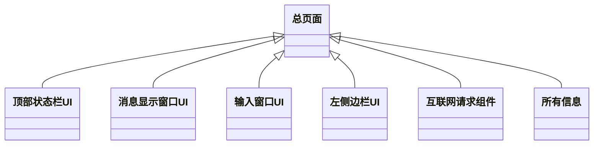
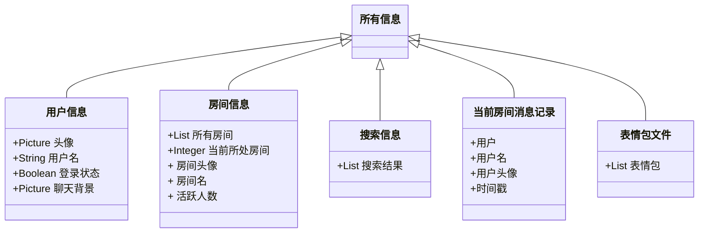
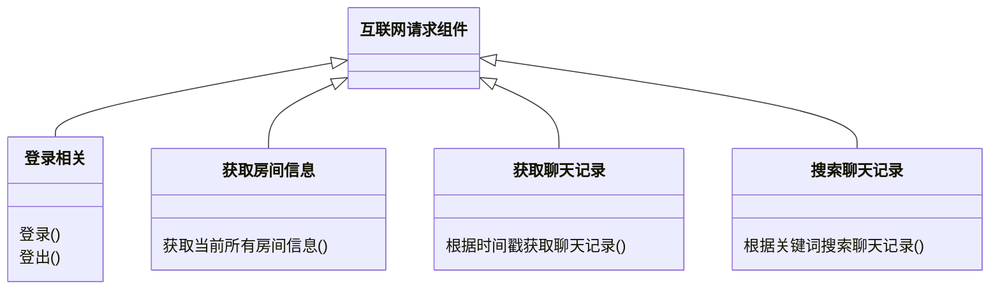
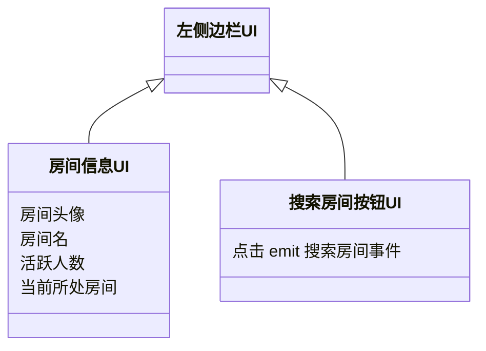
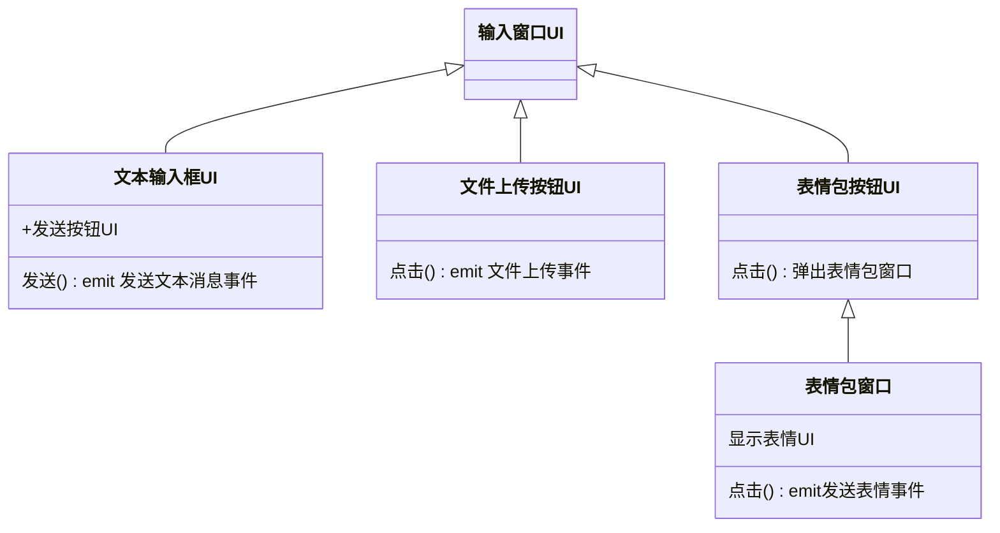
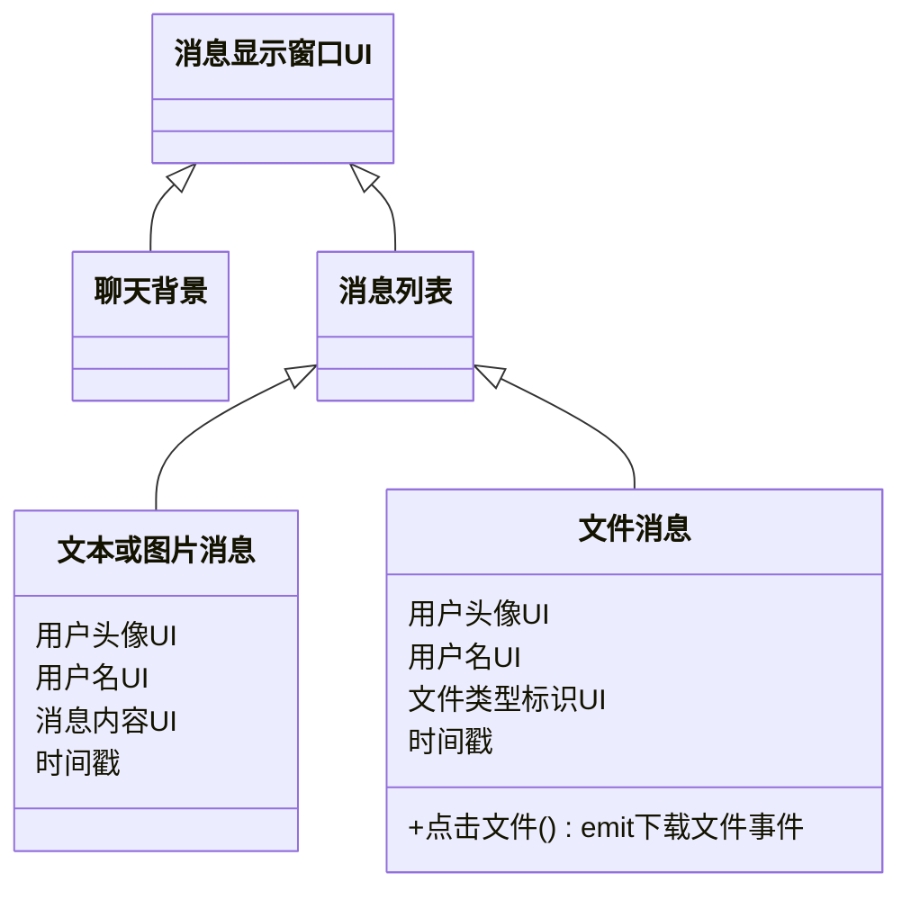
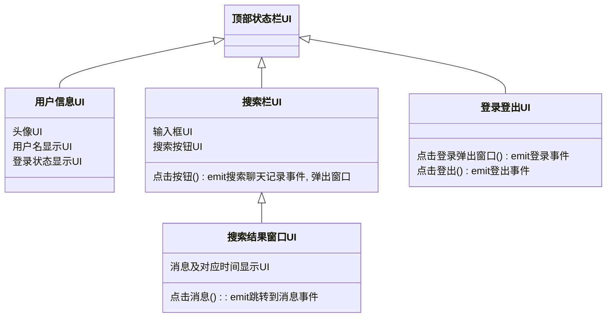

```mermaid
classDiagram
总页面 <|-- 顶部状态栏UI
总页面 <|-- 消息显示窗口UI
总页面 <|-- 输入窗口UI
总页面 <|-- 左侧边栏UI
总页面 <|-- 互联网请求组件
总页面 <|-- 所有信息

```

```mermaid
classDiagram
所有信息 <|-- 用户信息
所有信息 <|-- 房间信息
所有信息 <|-- 搜索信息
所有信息 <|-- 当前房间消息记录
所有信息 <|-- 表情包文件

class 用户信息{
	+Picture 头像
	+String 用户名
	+Boolean 登录状态
	+Picture 聊天背景
}

class 搜索信息{
	+List 搜索结果
}

class 房间信息{
	+List 所有房间
	+Integer 当前所处房间
	+ 房间头像
	+ 房间名
	+ 活跃人数
}

class 当前房间消息记录{
	+用户
	+用户名
	+用户头像
	+时间戳
}

class 表情包文件{
	+List 表情包
}
```

```mermaid
classDiagram 
互联网请求组件 <|-- 登录相关
互联网请求组件 <|-- 获取房间信息
互联网请求组件 <|-- 获取聊天记录
互联网请求组件 <|-- 搜索聊天记录

class 登录相关{
	登录()
	登出() 
}

class 获取房间信息{
	获取当前所有房间信息()
}

class 获取聊天记录{
	根据时间戳获取聊天记录()
}

class 搜索聊天记录{
	根据关键词搜索聊天记录()
}
```

```mermaid
classDiagram
左侧边栏UI <|-- 房间信息UI
左侧边栏UI <|-- 搜索房间按钮UI
class 房间信息UI{
	房间头像
	房间名
	活跃人数
	当前所处房间
}
class 搜索房间按钮UI{
	点击 emit 搜索房间事件
}
```

```mermaid
classDiagram
输入窗口UI <|-- 文本输入框UI
输入窗口UI <|-- 文件上传按钮UI
输入窗口UI <|-- 表情包按钮UI

class 文本输入框UI{
	+发送按钮UI
	发送() emit 发送文本消息事件
}

class 文件上传按钮UI{
	点击() emit 文件上传事件
}

class 表情包按钮UI{
	点击() 弹出表情包窗口
}
表情包按钮UI <|-- 表情包窗口
class 表情包窗口{
 	显示表情UI
 	点击() emit发送表情事件
}
```

```mermaid
classDiagram
消息显示窗口UI <|-- 聊天背景
消息显示窗口UI <|-- 消息列表
消息列表 <|-- 文本或图片消息
消息列表 <|-- 文件消息
class 文本或图片消息{
	用户头像UI
	用户名UI
	消息内容UI
	时间戳
}

class 文件消息{
	用户头像UI
	用户名UI
	文件类型标识UI
	时间戳
	+点击文件() emit下载文件事件
}
```

```mermaid
classDiagram
顶部状态栏UI <|-- 用户信息UI
顶部状态栏UI <|-- 搜索栏UI
顶部状态栏UI <|-- 登录登出UI

class 用户信息UI{
	头像UI
	用户名显示UI
	登录状态显示UI
}

class 登录登出UI{
	点击登录弹出窗口() emit登录事件
	点击登出() emit登出事件
}

class 搜索栏UI{
	输入框UI
	搜索按钮UI
	点击按钮() emit搜索聊天记录事件, 弹出窗口
} 
搜索栏UI <|-- 搜索结果窗口UI

class 搜索结果窗口UI{
	消息及对应时间显示UI
	点击消息() : emit跳转到消息事件
}
```

