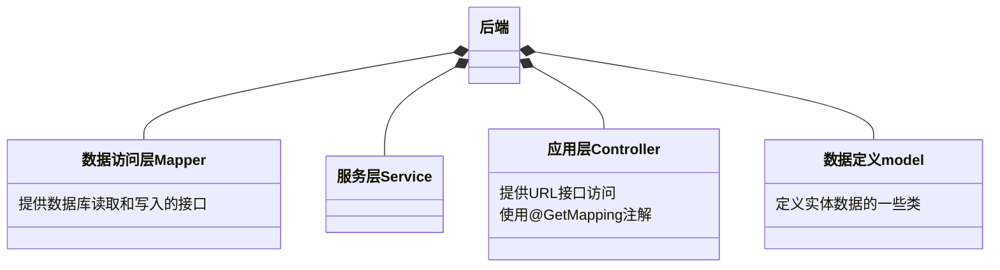

### 表的定义

#### 1.房间表

| RoomName | RoomOwnerId |
| -------- | ----------- |
| String   | String      |

#### 2.用户表

| UserId | FakeName | Passwd | Cookie |
| ------ | -------- | ------ | ------ |
| String | String   | String | String |

#### 3.消息表

### 分布式缓存技术：

​	给的后端的demo代码中，给出了Hazelcast的使用方法示例。Hazelcast是一个嵌入式的分布式缓存，可以帮助解决服务器节点之间的同步、一致性问题。Hazelcast提供Map、List等分布式数据结构，示例代码中使用了其中的的IMap数据结构。

​	可以在分布式缓存基础进一步实现持久化到本地数据库的操作，实现每个节点都有持久化的副本。

​	

​	

